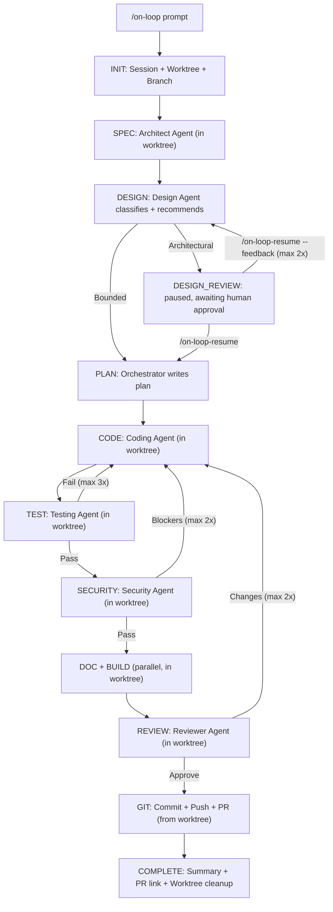

# On-Loop

Spec-driven SDLC plugin for [Claude Code](https://docs.anthropic.com/en/docs/claude-code) that orchestrates specialist agents through a full development lifecycle with security-first engineering practices.

## What It Does

`/on-loop` takes a prompt and runs it through a complete software development pipeline:

```
Prompt → Worktree → Branch → Spec → Design → Plan → Code → Test → Security → Docs + Build → Review → Commit + Push + PR → Done
```

The **Design** step classifies the change and, for architectural-scope work, pauses the loop for explicit human approval before any code is written — see [Design Gate](#design-gate) below.

Each phase is handled by a specialist agent operating as a Staff Engineer with ISC2 certifications, building for regulated financial environments and critical infrastructure.

Each session operates in its own **git worktree**, so multiple sessions can run concurrently on the same repo without interference. Session logs are persisted in the repo as an audit trail.

## Installation

### Option 1: Marketplace (recommended)

Add the on-loop marketplace, then install the plugin:

```
/plugin marketplace add joestein/on-loop
```

This registers the marketplace from the repo's `marketplace.json`. Then install the plugin:

```
/plugin install on-loop
```

That's it — all `/on-loop` commands are now available in your Claude Code sessions.

> **How it works**: The `marketplace.json` at the repo root declares available plugins. When you run `/plugin marketplace add`, Claude Code fetches this manifest and makes the listed plugins available for install. `/plugin install` then activates the plugin, loading its commands, agents, skills, and hooks.

### Option 2: Clone to plugins directory

```bash
git clone https://github.com/your-org/on-loop.git ~/.claude/plugins/on-loop
```

### Option 3: Symlink

```bash
git clone https://github.com/your-org/on-loop.git ~/dev/on-loop
ln -s ~/dev/on-loop ~/.claude/plugins/on-loop
```

### Option 4: Project-local

Clone or copy into your project and reference it in your project's Claude Code configuration.

## Commands

| Command | Description |
|---------|-------------|
| `/on-loop <prompt>` | Run full SDLC loop with all agents |
| `/on-loop-check [PR number or branch]` | Check GitHub CI status, fix regressions, alert on pre-existing failures |
| `/on-loop-debug-fix [description or image]` | Debug and fix issues from infrastructure logs or user-provided context |
| `/on-loop-status` | Check progress of current and past sessions |
| `/on-loop-resume [--from=phase] [--session=<id>] [--feedback="..."]` | Resume an interrupted loop, or approve/revise a paused Design Gate |
| `/on-loop:clear [--include-logs]` | Clean up worktrees, optionally remove session logs |
| `/on-loop:main-resolve` | Pull main, merge into branch, resolve conflicts |
| `/on-spec <description>` | Standalone spec generation |
| `/on-test <target>` | Standalone test generation |
| `/on-security <target>` | Standalone security audit |
| `/on-doc <target>` | Standalone documentation generation |
| `/on-build <target>` | Standalone build/CI setup |
| `/on-review <target>` | Standalone code review |

### Roadmap Commands (Multi-Session)

| Command | Description |
|---------|-------------|
| `/on-prepare <prompt>` | Generate a roadmap with phases, steps, and acceptance criteria |
| `/on-plan [feature-slug]` | Read roadmap, produce detailed implementation plan |
| `/on-continue [feature-slug]` | Pick up next available step and execute through agent pipeline |
| `/on-pause [feature-slug]` | Release locks, commit WIP, write handoff summary |

## Agents

| Agent | Model | Role |
|-------|-------|------|
| Orchestrator | Opus | Pipeline control, quality gates, retry logic, worktree/session lifecycle |
| Architect | Opus | Spec generation, ADRs, system design |
| Design | Opus | Scope classification, approach exploration, human approval gate for architectural work |
| Coding | Opus | Implementation with security-first practices |
| Testing | Sonnet | Unit, integration, and E2E tests |
| Security | Opus | OWASP/STRIDE audit, compliance checks (read-only) |
| Documentation | Sonnet | READMEs, guides, CLAUDE.md files |
| Build | Sonnet | Makefile, GitHub Actions, lint/security configs |
| Reviewer | Opus | Final code review gate (read-only) |

## Architecture



### Worktree Isolation

Each session creates a git worktree at `.claude/worktrees/<branch-slug>/`, providing an independent working directory. This means:

- Multiple `/on-loop` sessions can run concurrently on the same repo
- The user's working directory is never modified during a loop run
- Each session has its own branch and isolated file state
- Worktrees share the git object store, so they are space-efficient

### Session Logs

Each session persists its state under `.on-loop/sessions/<YYYYMMDD_HHMMSS_branch-slug>/`:

```
.on-loop/
├── index.json                  # Manifest of all sessions
└── sessions/
    ├── 20260426_143052_user-management-api/
    │   ├── state.json          # Phase tracking
    │   ├── plan.md             # Implementation plan
    │   ├── changes.log         # File modification log
    │   └── agent-notes/        # Per-agent structured output
    └── 20260426_150311_auth-middleware/
        └── ...
```

Session directories are named with timestamps for chronological sorting and branch slugs for human readability.

Session directories are committed to the repo as audit logs, providing a record of what the AI agents did, decided, and found.

### Design Gate

Between SPEC and PLAN, the **design agent** classifies the change and decides whether a human needs to weigh in before any code is written. This is adapted from [superpowers'](https://github.com/obra/superpowers) `brainstorming` skill: explore approaches, recommend one, and gate implementation behind approval — fit to on-loop's autonomous, resumable pipeline instead of a synchronous chat turn.

- **Bounded** (a change to a flow that already exists in the repo): the design agent picks the approach that fits the existing pattern, writes a short rationale to `design.md`, and the loop continues straight to PLAN. The PR review at the end is still the human checkpoint, same as any other on-loop change.
- **Architectural** (new subsystem, new schema, new/changed external interface): the design agent proposes 2-3 approaches with trade-offs, recommends one, and the loop **pauses** at `DESIGN_REVIEW` — no code gets written until a human responds:
  - `/on-loop-resume` — approve the recommendation and continue to PLAN
  - `/on-loop-resume --feedback="..."` — request a revision (up to 2 rounds, then the loop proceeds with the latest recommendation and a recorded TODO)

The design doc lives at `.on-loop/sessions/<session-name>/agent-notes/design.md` alongside every other agent's notes. See `skills/on-loop-design/SKILL.md` for the full classification criteria and gate mechanics.

### Quality Gates

Each phase transition is validated:

| Transition | Key Criteria |
|-----------|--------------|
| DESIGN -> PLAN or DESIGN_REVIEW | Classification and recommendation present; routes on `approval_required` |
| DESIGN_REVIEW -> PLAN | Human approved, or feedback rounds exhausted |
| CODE -> TEST | Code compiles, no self-reported critical issues |
| TEST -> SECURITY | All tests pass |
| SECURITY -> DOC/BUILD | No critical/high security findings |
| REVIEW -> GIT | Reviewer approves |
| GIT -> COMPLETE | Commit, push, PR created |

Failed gates trigger retries (DESIGN_REVIEW->DESIGN: 2x on human feedback, TEST->CODE: 3x, SECURITY->CODE: 2x, REVIEW->CODE: 2x). After exhaustion, issues are recorded as TODOs and the pipeline continues.

## Agent Persona

All agents operate as **Staff Software Engineers** with ISC2 certifications (CISSP, CCSP, CSSLP, ISSAP, ISSEP, ISSMP) targeting:

- Regulated financial services (banking, trading, insurance)
- Critical infrastructure
- Multi-tenant SaaS

Security principles: zero trust, defense in depth, least privilege, fail secure, secure by default.

Compliance awareness: SOC2, PCI-DSS, NIST 800-53, ISO 27001, GDPR.

## Example Usage

### Full SDLC Loop

```
/on-loop Create a REST API for user management with JWT authentication, role-based access control, and PostgreSQL storage
```

### Concurrent Sessions

```
# Terminal 1
/on-loop Add user registration with email verification

# Terminal 2 (same repo, different Claude Code session)
/on-loop Add password reset flow with OTP
```

Each runs in its own worktree — no conflicts.

### Standalone Commands

```
/on-security src/auth/           # Audit auth module
/on-test src/api/handlers.ts     # Generate tests for handlers
/on-doc                          # Document the entire project
/on-review                       # Review all uncommitted changes
```

### Resume After Interruption

```
/on-loop-status                           # Check all sessions
/on-loop-resume                           # Resume most recent active/failed session
/on-loop-resume --session=20260426_143052_user-api --from=TEST  # Resume specific session
```

### Cleanup

```
/on-loop:clear                  # Remove worktrees, keep session logs
/on-loop:clear --include-logs   # Remove everything
```

## Project Structure

```
on-loop/
├── .claude-plugin/plugin.json   # Plugin metadata (v0.5.0)
├── .on-loop/                    # Session logs (committed to repo)
│   ├── index.json               # Session manifest
│   └── sessions/                # Per-session state and agent notes
├── hooks/hooks.json             # Stop + PostToolUse hooks
├── commands/                    # 17 user-invocable commands
├── agents/                      # 8 specialist agent definitions
├── skills/                      # Loop state + quality gate + roadmap skills
├── shared/                      # Shared persona, protocols, standards
├── CLAUDE.md                    # Plugin instructions
├── README.md                    # This file
└── LICENSE                      # Apache 2.0
```

## License

Apache 2.0 — see [LICENSE](LICENSE).
